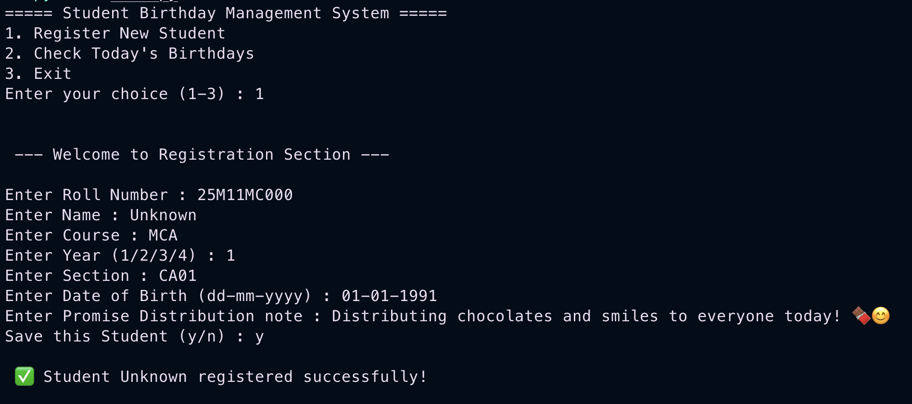
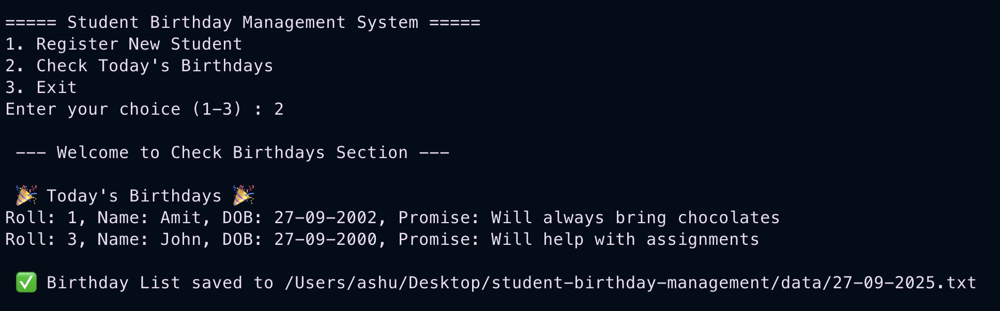
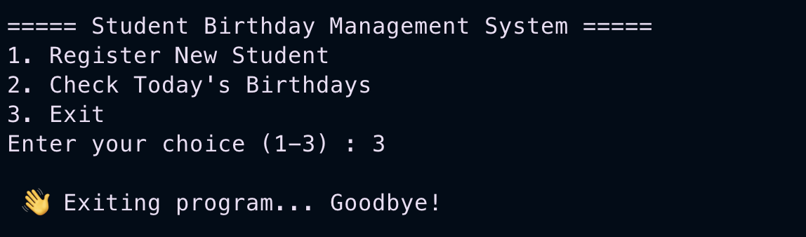
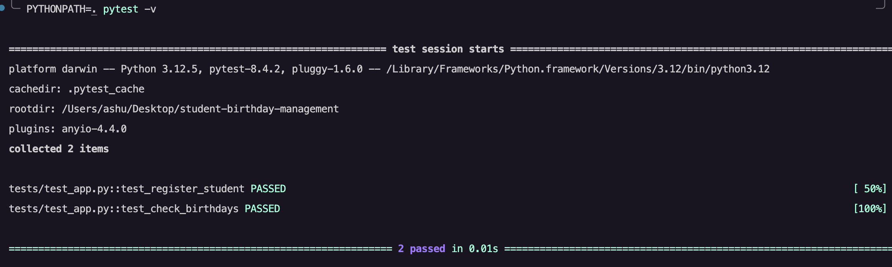

# 🎂 Student Birthday Management System 🎉

[](https://www.python.org/)
[]()
[](LICENSE)

---

## 📌 Problem Statement

A menu-driven Python program to manage student records and check whose birthdays fall on the current date.  
This project demonstrates Python fundamentals including conditionals, loops, dictionaries, file handling, and modules like `datetime`, `json`, and `os`.

---

## 🚀 Features (Core Requirements ✅)

- Register new student with:
  - Roll No, Name, Course, Year, Section, DOB, Promise Note  
- Store all student records in `students.txt` (JSON format).  
- Check today’s birthdays:
  - Compare DOB with today’s date.  
  - Print details on screen.  
  - Save results in a file named `DD-MM-YYYY.txt` inside the `data/` folder.  
- Exit the program safely.  

---

## 🔮 Future Improvements (Scalable 🚀)

- Update or delete student records.  
- Search students by Roll Number or Name.  
- Upcoming birthdays reminder (next 7 days).  
- GUI / Web interface using Streamlit or Flask.  
- Integration with Google Sheets or a SQL database.  
- Dockerized deployment for portability.  

---

## 🛠 Tech Stack

- **Language**: Python 3.12.5  
- **Built-in Libraries**: `json`, `datetime`, `os`  
- **Testing**: `pytest`

---

## 📂 Project Structure

```bash
student-birthday-management/
│
├── data/                   # Data files (students.txt, daily birthday lists)
│   └── .gitkeep
├── docs/
│   ├── design.md           # Detailed design document
│   └── flow_diagram.png    # Workflow diagram
├── screenshots/            # Screenshots of program execution
│   ├── Check_Birthdays_Section.png
│   ├── Exit.png
│   ├── Registration_Section.png
│   ├── FULL CLI.png
│   └── Pytest.png
├── src/
│   └── main.py             # Core Python code
├── tests/
│   └── test_app.py         # Automated tests (pytest)
├── .gitignore
├── LICENSE
└── README.md
``` 

## ▶️ How to Run
### 1️⃣ Clone the repository
```bash
git clone https://github.com/your-username/student-birthday-management.git
cd student-birthday-management
```
### 2️⃣ Run the program
```bash
python3 src/main.py
```
### 3️⃣ Run tests
```bash
PYTHONPATH=. pytest -v
```

## 📸 Screenshots
✅ Full CLI DEMO


📝 Register a Student


🎉 Check Today’s Birthdays


❌ Exit 


🧪 Run Tests with Pytest


### 📜 License  
This project is licensed under the [MIT License](LICENSE).

🙌 Credits
Developed as a Python mini-project to practice file handling, input validation, and automated testing using pytest.
