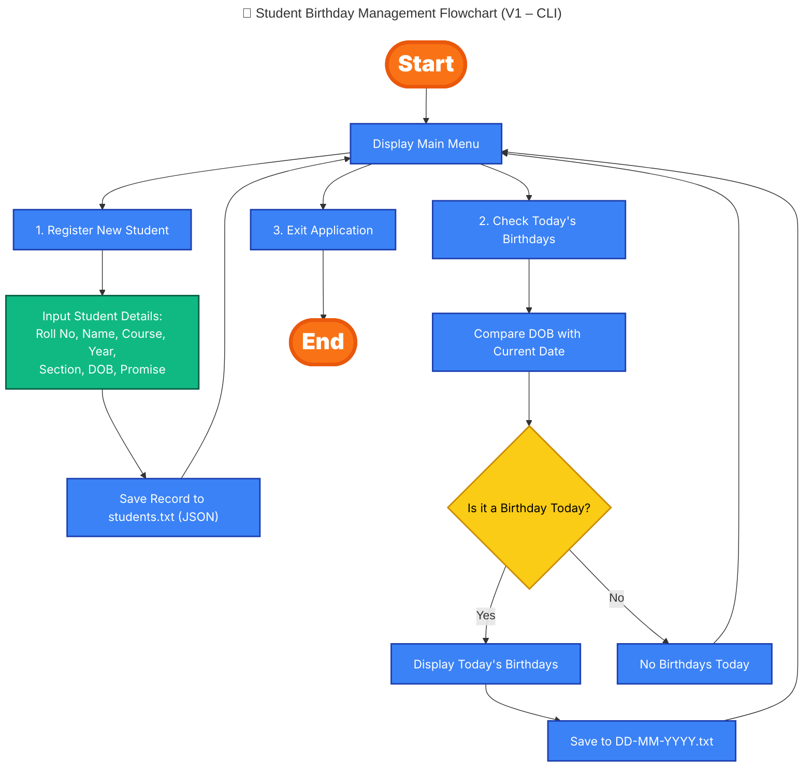

# 🎂 Student Birthday Management System 🎉

[](https://www.python.org/)
[]()
[](LICENSE)

---

## 📌 Problem Statement

A menu-driven Python program to manage student records and check whose birthdays fall on the current date.  
This project demonstrates Python fundamentals including conditionals, loops, dictionaries, file handling, and modules like `datetime`, `json`, and `os`.

---

## 🚀 Features (V1 – CLI)

- Register new student with:
  - Roll No, Name, Course, Year, Section, DOB, Promise Note  
- Store all student records in `students.txt` (JSON format).  
- Check today’s birthdays:
  - Compare DOB with today’s date.  
  - Print details on screen.  
  - Save results in a file named `DD-MM-YYYY.txt` inside the `data/` folder.  
- Exit the program safely.  

---
## 🛠 Tech Stack

- **Language**: Python 3.12.5  
- **Built-in Libraries**: `json`, `datetime`, `os`, `sys`
---

## 📂 Project Structure

```bash
student-birthday-management/
│
├── data/                   # Data files (students.txt, daily birthday lists)
├── src/
│   └── birthday_manager.py # Core Python code
├── .gitignore
├── LICENSE
└── README.md
``` 
---

## 📊 Flow Diagram

Here’s a high-level flow of how the system works:


<!-- <p align="center">
  
</p> -->


---

## 🚀 How to Run on Your Machine

### 1️⃣ Clone the repository and change directory (same for macOS/Linux and Windows)
```bash
git clone https://github.com/SekharUppuluri/student-birthday-management.git
cd student-birthday-management
```

### 2️⃣ Run the Program and Tests

Follow the steps below to run the program and tests on your system:

|   Step       |      macOS/Linux           |       Windows                   |
|:------------- |:--------------------------|:-------------------------------|
| **Run program** | `python3 src/birthday_manager.py`      | `python src\birthday_manager.py`             |

> **Note**: On **Windows**, make sure to use `src\birthday_manager.py` with backslashes for the file path.


## 📸 Screenshots (V1)
- ✅ Full CLI DEMO


- 📝 Register a Student
  


- 🎉 Check Today’s Birthdays


- ❌ Exit 


### 📜 License  
This project is licensed under the [MIT License](LICENSE).

---

## 🧑‍💻 Author  
**Sekhar Uppuluri**  
[GitHub: @SekharUppuluri](https://github.com/SekharUppuluri)


