# 🎂 Student Birthday Management System 🎉

[](https://www.python.org/)
[]()
[](LICENSE)

---

## 📌 Problem Statement

A menu-driven Python program to manage student records and check whose birthdays fall on the current date.  
This project demonstrates Python fundamentals including conditionals, loops, dictionaries, file handling, and modules like `datetime`, `json`, and `os`.

📄 **For an in-depth system design and project details, see the [design document](docs/design.md).**

---

## 🚀 Features (Core Requirements ✅)

- Register new student with:
  - Roll No, Name, Course, Year, Section, DOB, Promise Note  
- Store all student records in `students.txt` (JSON format).  
- Check today’s birthdays:
  - Compare DOB with today’s date.  
  - Print details on screen.  
  - Save results in a file named `DD-MM-YYYY.txt` inside the `data/` folder.  
- Exit the program safely.  

---

## 🔮 Future Improvements (Scalable 🚀)

- Update or delete student records.  
- Search students by Roll Number or Name.  
- Upcoming birthdays reminder (next 7 days).  
- GUI / Web interface using Streamlit or Flask.  
- Integration with Google Sheets or a SQL database.  
- Dockerized deployment for portability.  

---

## 🛠 Tech Stack

- **Language**: Python 3.12.5  
- **Built-in Libraries**: `json`, `datetime`, `os`  
- **Testing**: `pytest`

---

## 📂 Project Structure

```bash
student-birthday-management/
│
├── data/                   # Data files (students.txt, daily birthday lists)
│   └── .gitkeep
├── docs/
│   ├── design.md           # Detailed design document
│   └── flow_diagram.png    # Workflow diagram
├── screenshots/            # Screenshots of program execution
│   ├── Check_Birthdays_Section.png
│   ├── Exit.png
│   ├── Registration_Section.png
│   ├── FULL CLI.png
│   └── Pytest.png
├── src/
│   └── main.py             # Core Python code
├── tests/
│   └── test_app.py         # Automated tests (pytest)
├── .gitignore
├── LICENSE
└── README.md
``` 
---

## 📊 Flow Diagram

Here’s a high-level flow of how the system works:

```mermaid
---
config:
title: 🎂 Student Birthday Management Flowchart
---

flowchart TD
    A(["Start"]) --> B["Display Main Menu"]
    B --> C["1. Register New Student"] & F["2. Check Today's Birthdays"] & L["3. Exit Application"]
    C --> D["Input Student Details:<br>Roll No, Name, Course, Year,<br>Section, DOB, Promise"]
    D --> E["Save Record to students.txt (JSON)"]
    E --> B
    F --> G["Compare DOB with Current Date"]
    G --> H{"Is it a Birthday Today?"}
    H -- Yes --> I["Display Today's Birthdays"]
    I --> K["Save to DD-MM-YYYY.txt"]
    K --> B
    H -- No --> J["No Birthdays Today"]
    J --> B
    L --> M(["End"])

    %% Node styles
    classDef bigEndStart fill:#f97316,stroke:#ea580c,stroke-width:5px,color:#fff,font-size:30px,font-family:Inter,Arial Black,sans-serif,font-weight:900
    classDef decision fill:#facc15,stroke:#ca8a04,stroke-width:2px,color:#000,font-family:Inter,sans-serif
    classDef inputNode fill:#10b981,stroke:#065f46,stroke-width:2px,color:#fff,font-family:Inter,sans-serif
    classDef process fill:#3b82f6, stroke:#1e40af, stroke-width:2px, color:#fff, font-family:Inter, sans-serif

    %% Apply styles
    A:::bigEndStart
    M:::bigEndStart
    B:::process
    C:::process
    F:::process
    L:::process
    D:::inputNode
    E:::process
    G:::process
    H:::decision
    I:::process
    K:::process
    J:::process

```


<!-- <p align="center">
  
</p> -->

📄 For a deeper dive, check the full [design document](docs/design.md).

---

## 🚀 How to Run on Your Machine
### 1️⃣ Clone the repository
- First, clone the repo to your local machine:
```bash
git clone https://github.com/SekharUppuluri/student-birthday-management.git
cd student-birthday-management
```
### 2️⃣ Run the program
- Run the main application:
```bash
python3 src/main.py
```
### 3️⃣ Run tests
- To run the tests and verify everything is working:
```bash
PYTHONPATH=. pytest -v
```

## 📸 Screenshots
- ✅ Full CLI DEMO


- 📝 Register a Student
  


- 🎉 Check Today’s Birthdays


- ❌ Exit 


- 🧪 Run Tests with Pytest


### 📜 License  
This project is licensed under the [MIT License](LICENSE).

---

## 🙌 Credits  
Developed as a mini Python project to practice managing student records, birthday checks, file handling, input validation, and automated testing with pytest.  
Future enhancements include building a user-friendly interface using Streamlit or Flask.

---

## 🔗 Live Demo  
Try it out: [Demo Link](https://your-demo-link.com)  <!-- Replace with actual link or remove if not available -->

---

## 🤝 Contributing  
 Pull requests are welcome. For major changes, please open an issue first to discuss what you’d like to change.

---

## 🧑‍💻 Author  
**Sekhar Uppuluri**  
[GitHub: @SekharUppuluri](https://github.com/SekharUppuluri)


